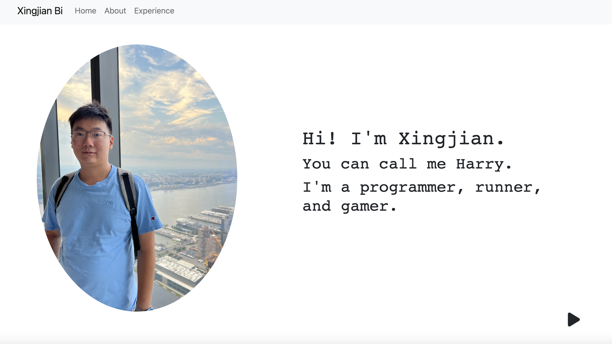
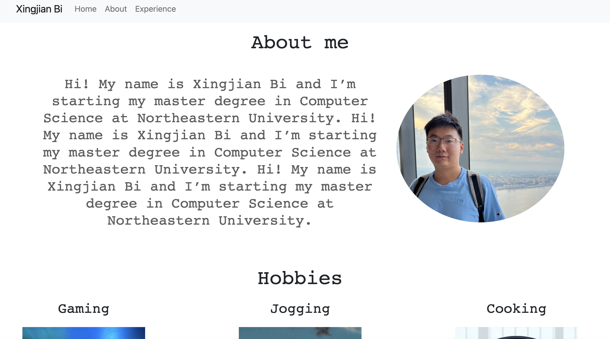
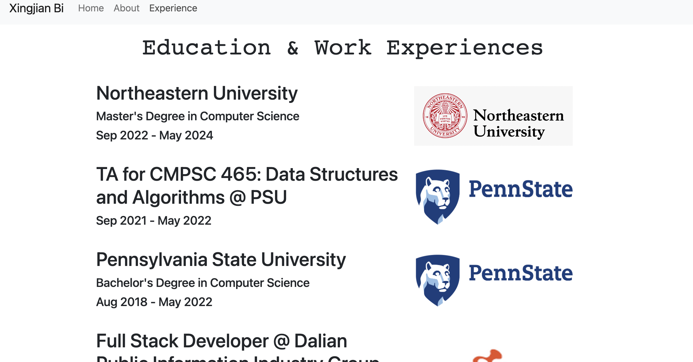

# Xingjian Bi's Homepage

This is the repository for my homepage which provides information about my personal and educational experience.  This project was initially made for [CS5610](https://johnguerra.co/classes/webDevelopment_fall_2022/), but I'll keep the info up to date and continue maintain this website.

### Author 

[Xingjian Bi](https://xingjian-bi.github.io/homepage/)

### Objective

The objective is to get familair with HTML, CSS, Bootstrap, and JavaScript by creating this website that contains some basic information. This project is configured with eslint and all html files are W3C compliant.

### Tech Requirements

- HTML5
- CSS
- Bootstrap
- JavaScript
- Node.js
- Http-server

### File Structure

- images - cotains all images 
- scripts - cotains all JavaScripts 
- styles - contains CSS styling sheets
- eslintrc.js - eslintrc config file
- package.json - contains metadata and dependencies
- package-lock.json - locking dependencies' version

### To Install Locally

1. download the source code

2. install http-server using command `npm install -g reload`

3. run `http-server` at root directory of this project

4. navigate your brower to localhost:yourportnumber and enjoy!

   

### Slides & Video Demonstration

Coming soon

### Screenshots

